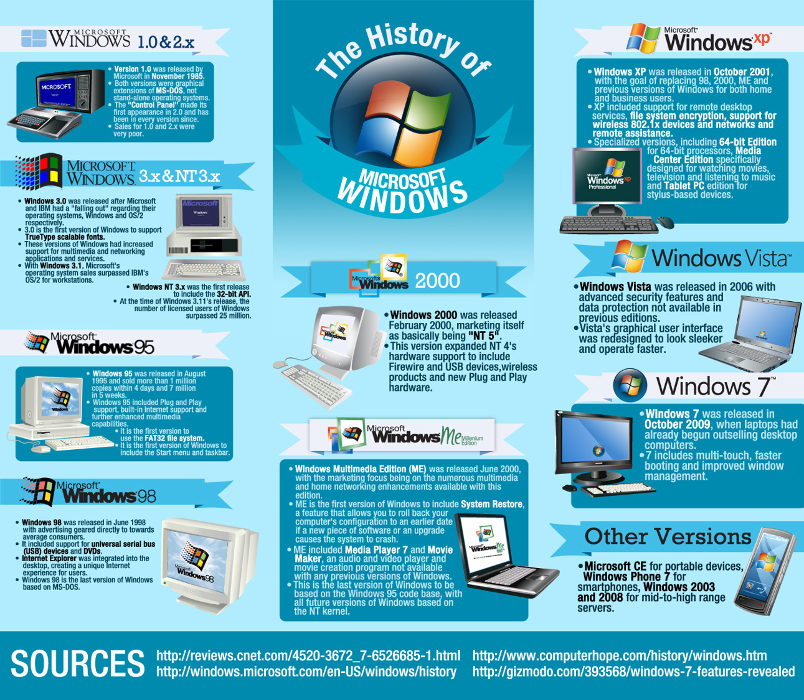
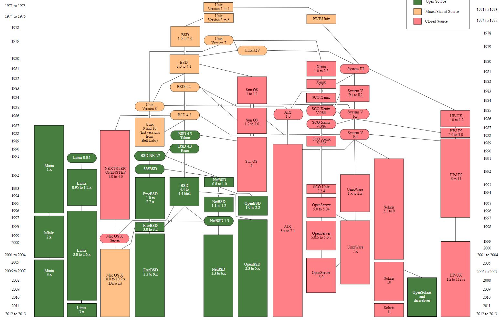

# Betriebssystemgeschichte

## Microsoft

BASIC-Interpreter

Xenix erstes Betriebssystem - ein Unix Clone

Parallel: Digital Research (Betriebssystem CP/M) schafft es nicht sich mit IBM einig zu werden

IBM gibt Microsoft den Zuschlag

Microsoft hat aber noch garkein CP/M kompatibles OS

Kauft sich Q-DOS (Quick and Dirty Operating System) von Seattle Computer Products, ein CP/M kompatibles OS und lizenziert es als MS-DOS an IBM

Wird durch den IBM PC und "IBM-Kompatiblen Rechnern" zum OS Marktführer für Personal Computer

Microsoft baut an einer GUI für DOS - Windows

mit Windows 1 - 3.11 bleibt es ein DOS Aufsatz

Parallel Vertrag mit IBM zur Entwicklung von OS/2

MS "betrügt" IBM mit Windows 95, lässt die Entwicklung von OS/2 schleifen

Netzwerkstack zunächst von BSD Unix, Reste bis heute zu erkennen (Ordnerstruktur "hosts-Datei")

## Unix / Linux

Unix entwickelt als Toyprojekt von Ken Thomsen und Dennis Ritchie in Verbindung mit der Programmiersprache C

Kann von Anfang an Multitasking und Multiuser

Ideen der "Unix-Philosophie"

 *  Alles ist eine Datei

*  Hierarchisches Filesystem

*  Kleine Programme, die nur eine Aufgabe erledigen, dafür aber gut

Weil AT/T keinen großen Nutzen erkennen, lizenzieren sie es kostenlos an Unis

Dort wird es bekannt - leider so sehr, dass AT/T plötzlich "Geld damit verdienen will"

Abspaltungen wie z.B. die Berkeley Software Distribution von Unix setzen sich aber durch

Kleinere Unixoide Betriebsysteme bleiben vor allem an Unis sehr bekannt

Minix ist eines an der Uni von Herrn Tanenbaum entwickeltes OS für Unterrichtszwecke

Linus Torvalds, ein Schüler von ihm baut einen "schlechten Clone" - wie Tanenbaum sagt

Daraus wird Linux

Parallel gründet Richards Stallman die GNU (GNUs not Unix)

Eine Softwaregruppe, die ein freies Betriebssystem entwickeln will

Hat aber nur einen schlecht Kernel (GNU Hurd)

Linux wird als Kernel mit den vorhandenen GNU Tools verbunden und daraus entsteht das GNU/Linux Betriebssystem

Distributionen fangen an ihre "Geschmacksrichtung" von Linux unter Selbstkosten zu vertreiben

Slackware und Debian sind die letzten "Großen Alten"

Bekannte sind RedHat, Suse, und alle anderen Myriaden unter distrowatch.com

MACOS X ist übrigens ein Hybridkernel, der BSD-Unix-Anteile hat

