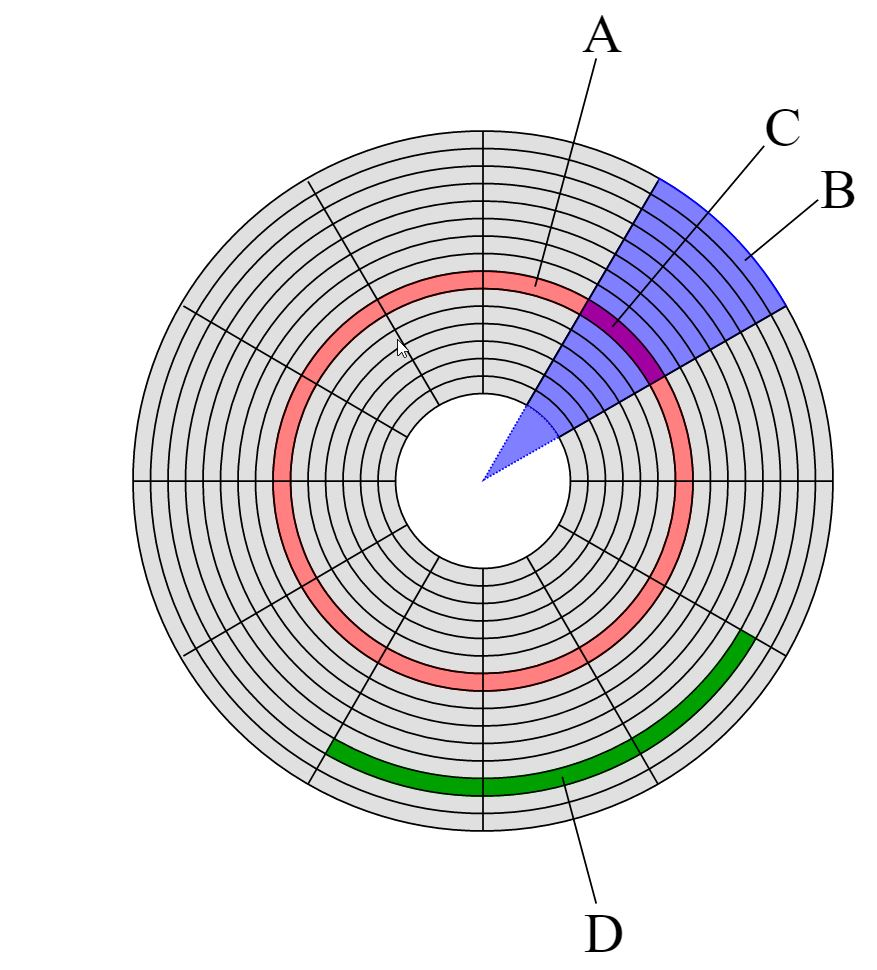

# Betriebssysteme

## Definition "Betriebssystem"

* Ist inhärente Software
* Ist Schnittstelle
  * zwischen Hardware
  * und Anwendung
* Ist für zwei Aufgaben zuständig:
  * Erweiterung der Hardware

  * Verwaltung der Ressourcen

## Erweiterung der Hardware
_Erleichterter Zugriff auf das System - Zugriff bisher nur über OP-Codes möglich_ 

* Vereinfachung und Standarisierung der Ein- und Ausgabe

* Vereinfachung und Standarisierung des Hardwarezugriffes

  * Beispiel: Festplattenzugriff

    _Warum sollte jedes Programm eigens einen Festplattentreiber und Dateisystemdetails implementieren?_

* Bereitstellung von APIs (Application Programming Interface)

  * Zugriff auf Hardwareressourcen

  * Allgemeine Hilfsbibliotheken (Verschlüsselung, 
  * Eigene Bibliotheken (GUI)

## Ressourcenverwaltung
_Verwaltung der vorhandenen Systemkomponenten_

* Als "Prozess Nummer 0" hat das Betriebssystem Vollzugriff auf alle Ressourcen
* Verteilung von "Taktzeiten" von
  * Speicher
  * Rechenzeit
* Unterteilung und Sicherung von Ressourcen (Sicherheit, Isolation, Speicherschutz, Gerechtigkeit/Fairness)
* Ermöglicht damit Multitasking und Multiuser

## Teile eines Betriebssystems

### Kernel

* Abstrahierung der Hardware

* Ressourcenverwaltung

* Isolierung von Prozessen und Speicherbereichen

### Systembibliotheken (APIs)

* APIs– Steuerung aufdie Hardwarezugriff durch die Anwendungssoftware

* Hilfsbibliotheken, bspw. Crypto

## Strukturen von Betriebssystemkerneln
* Monolithische Systeme

  •Alle Komponenten in einem Binaryzusammengefasst

  •Positiv: effiziente Kommunikation, priviligierte Zugriffe jederzeit

  •Negativ: viele Seiteneffekte,Änderungen führen zum Neustart, Fehlerträchtig (komplizierte

  •Strukturen, eine Komponente kannKern abstürzen lassen)

  •Abhilfe: ladbare Module (zurLaufzeit), Schichtmodelle (Memory-, Prozess-, I/O-, File-Manager)

* Client-Server-Kerne / Mikrokernel

  * Auslagerung von Komponenten ineigene Adressräume, Ausführung im Benutzermodus
  * Reduktion auf Basisfunktionen
  * Positiv: leichter zu pflegen,Fehlerfortpflanzung erschwert, Sicherheit
  * Negativ: teurer Kommunikation von Komponenten
  * Weiterentwicklung:  Verteilte System und Middleware (Remote Procedure Call/RPC)

* Virtuelle Maschinen

  * Zusammenfassung mehrerer logischerSysteme auf einer Hardware
  * Durch Hardware (IBM Mainframe,Intel V-Bit, AMD-V)

  oder

  * Virtualisierungssoftware (VMware, XEN, VirtualBox...)

* Exokernel

* Geschichtete Systeme

## Generationseinteilung nach Tanenbaum

* Erste Generation (1945-1955)

  _Röhrenrechner_

  * Maschinencode
  * Singe Process
  * Direktes Programmieren auf derHardware

* Zweite Generation (1955-1965)

  _Mainframes_

  * Transistorencomputer
  * Assembler
  * Batchverarbeitung auf Mainframes
  * Noch kein Multiuser

* Dritte Generation (1965-1980): 

  _Timeshareing_

  * Integrierte Schaltkreise (ICs)
  * Hochsprachen wie C
  * Mainframes: Timesharing, Virtuelle Maschinen
  * Multiuser, Multitask

* Vierte Generation (1980 bis heute)

  _Mikrocomputer_

  * ObjektorientierteProgrammiersprachen
  * Home Computer
  * Personal Computer
  * Teilweise Singleuser, teilweise Multiuser
  * Verteilte Systeme

## Unterteilung von BS nach Anwendungsgebiet

* Mainframe-OS (IBM OS390)
* Server-OS (Windows Server, Linux)
* PC Betriebsysteme (Windows 10, Linux)
* Echtzeitbetriebssysteme (QNX, VxWorks)
* Embedded Systeme (Emb.Linux, Windows CE)
* Chipkarten Systeme (JVM)
* Mobile-Systeme (IOS, Android, Symbian)

## Unterteilung von BS nach Betriebsart
* Anzahl Benutzer:
  _Single User vs. Multi User_
* Anzahl Prozessen: 
  _Singe Process vs. Multitasking_
* Zeitlich:
  _Batch Processing vs. Interaktiv (Dialog)_

## Betriebssytemkonzepte

* Multitasking

  * Unterschiedliche Arten von Multitasking:
    * Echtzeit OS
    * Kooparatives Multitasking
    * Präemptives Multitasking

* Prozess

  _Kapselung von Anwendung und Speicherbereich, inklusive Registern für Programmzeiger_

* Scheduler

  * Anwendungsunterbrechung durch Interrupt-Steuerung
  * Pointer-Rücksprung in das Betriebssystem und vom OS in die nächste Anwendung

* Deadlocks

  _Konkurrierender Zugriff auf Speicherbereiche müssen gehandhabt werden, sonst kommt es zu sog. Deadlocks_

* Interrupt

  _Ein Interrupt (engl. to interrupt,unterbrechen) ist die kurzfristige Unterbrechung eines Programms, um eine andere, meist kurze, aber zeitkritische Verarbeitung durchzuführen. Ausgelöst durch eine Unterbrechungsanforderung (Interrupt Request,IRQ) wird eine Unterbrechungsroutine (Interrupt Service Routine, ISR) ausgeführt.Anschließend wird die Ausführung des Programms an der Unterbrechungsstelle fortgesetzt. Sinn eines Interrupts ist es, auf Ein-/Ausgabe-Ereignisse (Signale) (z. B. vonTastatur, Maus, Festplatte, Netzwerk, Zeitgeber/Timerusw.) (schnell) reagieren zu können, während ein anderer Programmcode (z. B. von Anwendungsprogrammen) abgearbeitet wird._

# Wie wichtig sind Betriebssystem in der heutigen Zeit?

## Bootprozess
* Boot - von Boostrap - an den "Schnürsenkel aus dem Sumpf ziehen"

* Eine Verkettung von kleinen Programmen

* Typischerweise POST - BIOS - Bootloader 

## Grober Ablauf:

* Strom an
* POST - Power on self Test (Ist das was "Piep" wenn etwas schief läuft)

  * CPU Register checken
  * BIOS Code Checksumme prüfen
  * Überprüfung von DMA, Timern, etc.
  * RAM initialisieren
  * BIOS initialisieren
* BIOS Basic Input Output System (eigentlich Firmware - BIOS von IBM)
* Liegt auf einer ROM (Read Only Memory - typischerweise aber heute Flash oder EPROM)
  * ​ Initalisiert den Rest der Hardware
  * Hat eine Benutzeroberfläche um "Dinge" einzustellen
  * Findet die Geräte, von denen gebootet werden kann
  * Sucht den MBR - Master Boot Record
    *  The MBR besteht aus den ersten 512 Bytes (und mehr)
    *  64kb in Total mit erstem Bootloader (Aufgrund der geringen Größe kann der MBR keine Platten mit der Größe von 2 TB beschreiben)
  * Lädt den ersten Bootloader
  * Dieser kann die die bootfähigen Partitionen der Platte lesen
  * Ließt von der ersten "aktiven" Partition dort den VBR (Volume Boot Record)
  * Übergibt der CPU die erste Speicherposition der ausgewählten/ersten Bootpartition
  * Führt diese aus
* Windows bis XP NTLDR.exe - ab dann WINLOAD.exe
* Möglichkeit F8-Taste zu drücken und den Bootprozess zu verändern
* An einer bestimmten Stelle der Platte
* NTOSKRNL.exe
* Hat nur eine begrenzte Größe 
  ​

## Windows Fast StartUp / FastBoot

* Windows 8 und 10 fahren nicht mehr runter
* Gehen nurnoch in "Hibernate" Modus
* Damit sehr schnelles wieder hochfahren möglich
* ABER: kein echter Bootprozess
* Damit Schwierigkeiten, da in nicht konsistenten Zustand

## UEFI

* Behäbt die Größenbeschränkung vom MBR auf - GPT (Grand Partition Table) statt MBR auf Festplatten
* Netzwerkfähigkeit
* Modularer Aufbau
* Rückwärtskompatibilität

## Installationsablauf eines Betriebssystems

_Grob:_

* Hardware erkennen
* Treiber laden
* Installationsziel auswählen
* Notfalls Partitionieren und Formatieren
* Dateien kopieren
* Partition bootfähig machen
* Neustarten

## Dateisysteme

### Wie ist eine Festplatte aufgebaut?

A: Track

B: Sektor

C: Sektor eines Tracks = Block

D: Cluster 

* Block - kleinste Einheit auf der Festplatte

* Früher 512 Bytes

* Heute eher 4096-Byte
* Aufgrund der Aufteilung in Sektoren und Blöcke - Größenproblem beim MBR

## warum fängt die erste platte mit c an?

## Welche Dateisysteme gibt es

* FAT16/32
* exFAT
* NTFS
* ext4
* ZFS
* ...

## Wo liegt der Unterschied zwischen einer Datei und einem Programm?

- Datei genereller Begriff im Dateisystem - Ordner und Dateien
- Programm: Datei mit ausführbarem Binärcode
  - Typisiert in der Betriebssystem-API:
    - Linux ELF-Binärdatei
    - Windows PE-Binärdatei
- Andere Dateien: Textdateien - wie liegen die im Speicher? In welchem Format? 
  - ASCII
  - UTF8

## Welche Funktionen besitzt ein aktuelles Windows?

* GUI 
* CLI
* APIs
* Hardwaretreiber
* Filesystem
* Netzwerkstack
* Logging
* Benutzerverwaltung
* Systemmanagement (Domäne,GPOs, ...)
* Sicherheit
* ...
